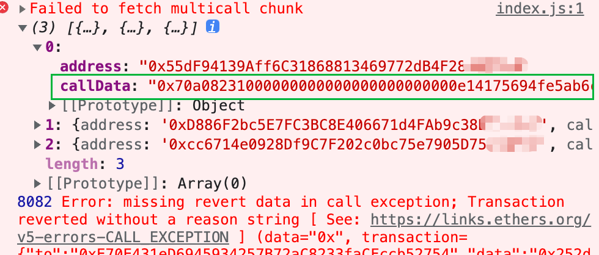
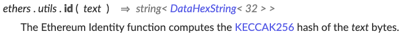
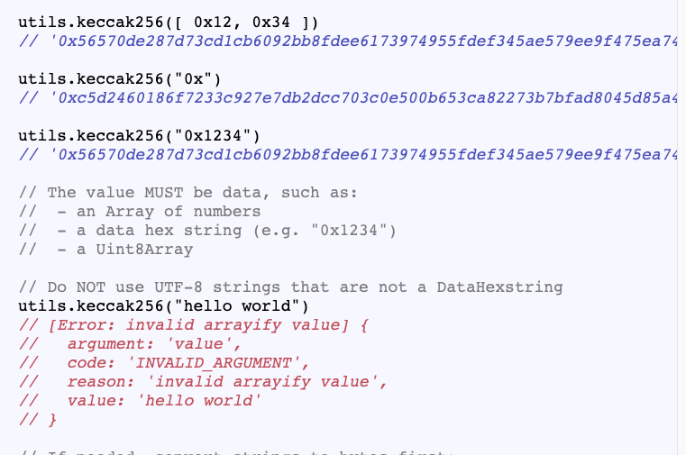
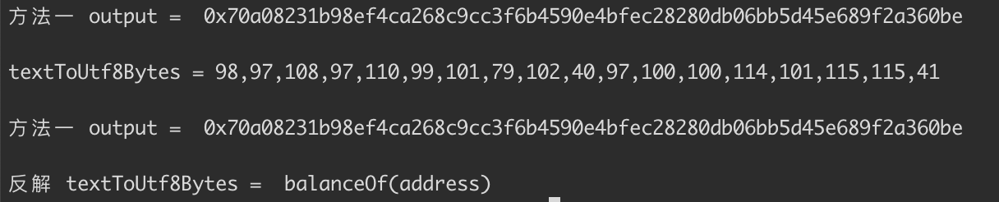
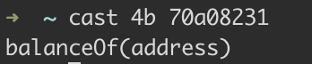

<!--
 * @LastEditors: Bot80926
 * @LastEditTime: 2023-05-10 00:28:41
 * @FilePath: /contract-notebook/function-name-to-hash-encode-and-decode/README.md
 * Copyright (c) 2023 by Bot80926, All Rights Reserved.
-->

## Solidity中哈希函数的编码与解码

### 起因

写这篇文章的起因，是我在前端调试合约的时候，发现合约报错了，点开命令行报错，发现返回的是合约的 `callData`，我直接表演一个眼前一黑，我怎么直接的知道是调用哪个方法的时候报错呢？ 于是有了这篇文章的探索

- 目标： 如何根据 `callData` 解析出调用函数

- 内容：从合约小白的角度，从哈希函数的前世今生开始讲起。如果你已经很了解这部分内容，可以直接划到底。
-用到的库： ethers \ foundry




## 哈希函数的前世今生


这一个部分直接引用 WTF 课程里对哈希函数的描述，讲解的很详细。 感谢社区的力量 [github.com/AmazingAng/WTFSolidity](https://github.com/AmazingAng/WTF-Solidity/blob/main/28_Hash/readme.md)

-----


哈希函数（hash function）是一个密码学概念，它可以将任意长度的消息转换为一个固定长度的值，这个值也称作哈希（hash）。这一讲，我们简单介绍一下哈希函数及在`solidity`的应用

一个好的哈希函数应该具有以下几个**特性**：
- 单向性：从输入的消息到它的哈希的正向运算简单且唯一确定，而反过来非常难，只能靠暴力枚举。 
- 灵敏性：输入的消息改变一点对它的哈希改变很大。
- 高效性：从输入的消息到哈希的运算高效。
- 均一性：每个哈希值被取到的概率应该基本相等。
- 抗碰撞性：
    - 弱抗碰撞性：给定一个消息`x`，找到另一个消息`x'`使得`hash(x) = hash(x')`是困难的。
    - 强抗碰撞性：找到任意`x`和`x'`，使得`hash(x) = hash(x')`是困难的。

### Hash的应用
- 生成数据唯一标识
- 加密签名
- 安全加密

### Keccak256
`Keccak256`函数是`solidity`中最常用的哈希函数，用法非常简单：
```solidity
哈希 = keccak256(数据);
```
### Keccak256和sha3
这是一个很有趣的事情：
1. sha3由keccak标准化而来，在很多场合下Keccak和SHA3是同义词，但在2015年8月SHA3最终完成标准化时，NIST调整了填充算法。**所以SHA3就和keccak计算的结果不一样**，这点在实际开发中要注意。
2. 以太坊在开发的时候sha3还在标准化中，所以采用了keccak，所以Ethereum和Solidity智能合约代码中的SHA3是指Keccak256，而不是标准的NIST-SHA3，为了避免混淆，直接在合约代码中写成Keccak256是最清晰的。


## 生成函数哈希

介绍完定义，我们回归到文章主题，第一步，如何把 ` balanceOf(address) => 0x70a08231 `

- ethers库里提供了两种方式

1. `ethers.utils.id('balanceOf(address)')` 可以看到输入一个 `text`, 会返回一个 `KECCAK256` 的哈希



2. 先将 `String` 转换成 `Utf8Bytes` 的格式，然后再用 `keccak256` 哈希加密. 这里要注意不能直接 `ethers.utils.keccak256(`balanceOf(address)`)` 这种方式会报错，`keccak256` 只支持 `DataHexstring` 格式的转换
 
   

```javascript
const textToUtf8Bytes = ethers.utils.toUtf8Bytes('balanceOf(address)')
const hashResult = ethers.utils.keccak256(textToUtf8Bytes)
```


3. 补充上面 `textToUtf8Bytes` 可以用 `ethers.utils.toUtf8String` 反解出 `String`


输出如下，除开 0x 的前四个bytes  `70a08231` 为我们要的目标函数的哈希：



## 反解哈希函数

上面我们获得了函数的哈希，那么现在到第二步，如何把 ` 0x70a08231 => balanceOf(address) `

- 反解也是两种方式 （可能不全，我目前只知道这两个办法）
- 第一种： [bytes4_signature](https://www.4byte.directory/signatures/?bytes4_signature=0x70a08231) 可以理解为一个巨大的  `Text Signature` 🆚 	`Bytes Signature` 的数据库，里面会定时去扫链上的合约，并将他们对应的 哈希值 与 方法名 存下来。能满足我们大多数开发的需求
- 第二种，用命令行解密。 
  - Step1: [instal foundry](https://book.getfoundry.sh/getting-started/installation)
  - Step2: `cast 4b 70a08231`
  - 


## 补充知识：前端仔会在哪里用到哈希函数？

答： **EIP-165** [规范文章](https://learnblockchain.cn/docs/eips/eip-165.html#%E8%A7%84%E8%8C%83)

```solidity
pragma solidity ^0.4.20;

interface ERC165 {
    /// @notice 查询一个合约时候实现了一个接口
    /// @param interfaceID  参数：接口ID, 参考上面的定义
    /// @return true 如果函数实现了 interfaceID (interfaceID 不为 0xffffffff )返回true, 否则为 false
    function supportsInterface(bytes4 interfaceID) external view returns (bool);
}
```


在 `EIP-165` 中 提议了标准化接口的概念，并标准化了接口标识。 这么说可能有些抽象。 翻译一下就是我们可以通过调用这个方法，知道该合约是否支持某个接口。 比如 对于 一个 `ERC-721` 标准的 NFT 来说， 我怎么知道他是否兼容支持 `ERC-2981` 呢 ?

- 首先明确 [ERC-2981](https://eips.ethereum.org/EIPS/eip-2981) 对于 `ERC-721` 多了哪些能力？
  - 可以为 NFT 设置版税， 新增了 `royaltyInfo(uint256,uint256)` 查询方法
  - 那么我们就可以写下面这么一个函数，来判断 NFT 的 Fee
  - 因为 function 定义了 `supportsInterface` 需要传入一个 bytes4 类型的数据，所以我们传入 `0x2a55205a`， 对应 `royaltyInfo(uint256,uint256)`。 如果返回 true， 则说明 这个 NFT 兼容了 ERC-2981 标准，我们可以查看它对应的版税费率。

```javascript
export const checkNftFeeAndGetFee = async ({ address, signer, tokenId }) => {
  const abi = ["function supportsInterface(bytes4) public view returns(bool)"];
  const checkContract = await createContract(address, abi, signer);
  const isSupportErc2981 = await checkContract.supportsInterface(0x2a55205a);
  let fee = 0;
  if (isSupportErc2981) {
    const nftContract = await createContract(address, erc2981ABI, signer);
    const result = await nftContract.royaltyInfo(
      tokenId,
      "100000000000000000000" // 100 * 10 ** 18, 因为要算费率，直接按100块钱算，返回多少就是对应的费率，比如 1 就是 1% 费率，
    );
    fee = Number(result?.royaltyAmount) / 10 ** 18;
  } else {
    fee = 0;
  }
  return fee.toString();
};
```